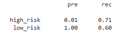
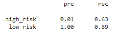
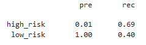
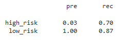
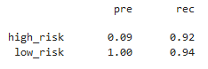

# Credit_Risk_Analysis

## Overview
The purpose of this analysis is to train a model to be able to determine the credit risk of a loan based on a number of factors ranging from loan amount to home ownership status. The difficulty with training a model using this dataset is that low risk loans are drastically overrepresented. Thus, a variety of models have been trained in order to determine the model that is best able to predict loan risk level despite having a low proportion of high risk loans.

## Results
These are the results of Naive Random Oversampling, SMOTE Oversampling, Undersampling using the Cluster Centroids algorithm, a combination of Over- and Under-sampling using the SMOTEENN algorithm, Balanced Random Forest Classifier, and Easy Ensemble AdaBoost Classifier for the balanced accuracy scores and the precision and recall scores. A random state of 1 was used for each model.

### Balanced Accuracy Score
* 0.657 : Naive Random Oversampling
* 0.662 : SMOTE Oversampling
* 0.545 : Undersampling
* 0.688 : Combination (Over and Under) Sampling
* 0.789 : Balanced Random Forest Classifier
* 0.932 : Easy Ensemble AdaBoost Classifier

The least accurate model was the Undersampling model, but by far the model with the highest balanced accuracy score was the Easy Ensemble AdaBoost Classifier. Due to small fraction of high risk loans, however, it is best to not rely on the accuracy score and to examine the precision and recall scores.

### Precision and Recall Score
* Naive Random Oversampling

* SMOTE Oversampling

* Undersampling

* Combination (Over and Under) Sampling

_Sampling.png)
* Balanced Random Forest Classifier

* Easy Ensemble AdaBoost Classifier

None of the models had above 0.1 precision for high risk loans, but the Easy Ensemble AdaBoost Classifier once again, was head and shoulders above the rest when it came to precision and recall.

## Summary
None of the models were notable horrendous - all had a balanced accuracy score higher than 0.5, and while none of them had a high precision in predicting high risk loans, they all had perfect precision with low risk loans. The recall was pretty decent for almost all the models, barring the ensemble learners and particularly the Easy Ensemble AdaBoost Classifier, with the lowest being 0.4 for low risk loans using the Undersampling model. The results show that the Easy Ensemble AdaBoost Classifier is the best to use, with the highest balanced accuracy score, highest precision score (which isn't saying much, but 0.09 is three times the next highest precision for predicting high risk loans), and the highest recall score.
